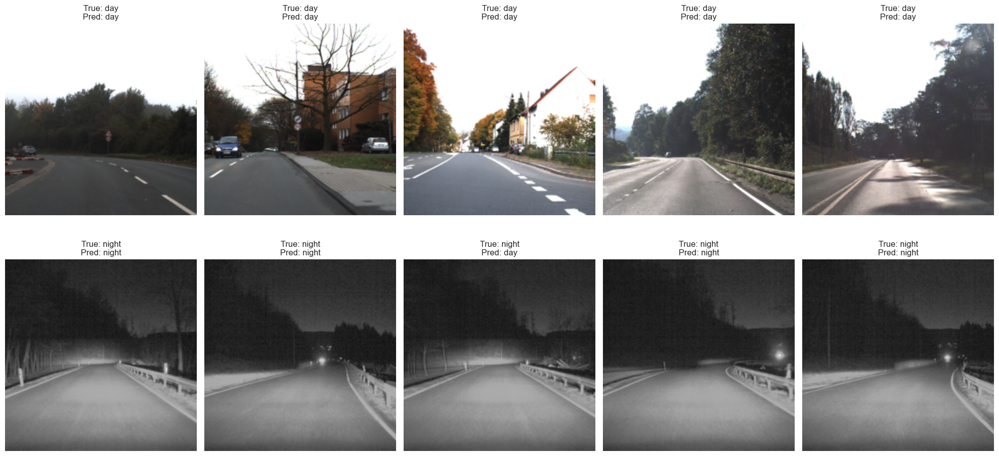

---

# Datasets and Image Preprocessing

## 1. Datasets
The images used in this project come from the following **publicly available** datasets:

- **KITTI (Raw Data)**  
  [Official Website](https://www.cvlibs.net/datasets/kitti/raw_data.php)  
  The KITTI dataset provides raw images captured under various conditions, including day and partial illumination scenarios.

- **PVDN (Provident Vehicle Detection at Night)**  
  [PVDN on Kaggle](https://www.kaggle.com/datasets/saralajew/provident-vehicle-detection-at-night-pvdn)  
  This dataset focuses on nighttime driving scenarios, making it especially useful for training and evaluating night detection models.

- **GTSDB (German Traffic Sign Detection Benchmark)**  
  [GTSDB Dataset](https://benchmark.ini.rub.de/gtsdb_dataset.html)  
  Contains a variety of traffic sign images, potentially in different lighting conditions, which can aid in generalizing detection models.

## 2. Converting Images from `.ppm` to `.png`
Some of the original datasets (e.g., GTSDB) may provide images in the `.ppm` format. To ensure compatibility with various frameworks (like PyTorch) and standard image processing libraries, you may want to convert them to `.png`. Below is an example script using **PIL** (Python Imaging Library):

```python
from PIL import Image
import os

# Update the paths below to match your local directories:
input_folder = r"C:\path\to\dataset\test\day"
output_folder = r"C:\path\to\dataset\test\day"

for filename in os.listdir(input_folder):
    if filename.endswith(".ppm"):
        input_path = os.path.join(input_folder, filename)
        output_path = os.path.join(
            output_folder,
            filename.replace(".ppm", ".png")
        )
        
        with Image.open(input_path) as img:
            img.save(output_path, "PNG")
        
        print(f"Converted {input_path} to {output_path}")
```

### Notes on Converting and Renaming
- After conversion, you might want to **rename** the files to maintain a continuous, sorted naming scheme (e.g., `00000001.png, 00000002.png, ...`). This helps when you’re batching images or relying on sequential file names for training or inference.
- Always confirm that your training scripts or data loaders point to the **correct** directory and file extensions after conversion.

## 3. Day/Night Detection Workflow
1. **Data Preparation**  
   - Download and extract the datasets from their respective sources.
   - (Optional) Convert `.ppm` images to `.png` or `.jpg` if needed.
   - Rename or reorganize files so they are consistent (especially if your training code requires a specific naming pattern).

2. **Jupyter Notebook & PyTorch**  
   - Use PyTorch (or another deep learning framework) within a Jupyter notebook to load these images and perform inference or training.
   - Set up a simple classification or detection model that classifies the images as “day” or “night,” or uses these images as part of a larger detection task.

3. **Example Result**  
   - Below is a sample output image showing the detection of a night-time scenario:



Results were saved to the file *.pth

## 4. Next Steps
- **Model Training**: Adjust hyperparameters for your specific tasks (day/night detection or other object detection tasks).
- **Evaluation**: Validate the model performance separately on each dataset (KITTI, PVDN, GTSDB) or on combined sets if your model must generalize to multiple conditions.
- **Deployment**: Integrate the trained model into your pipeline or application for real-time inference (e.g., on a car dashcam video stream).

---
