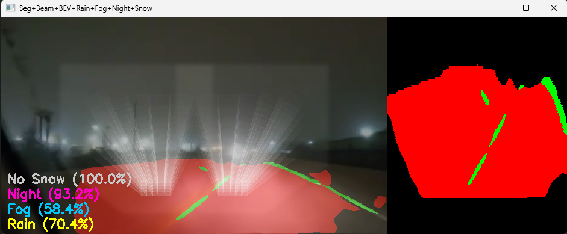
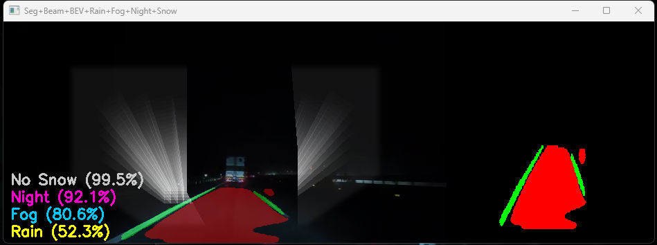
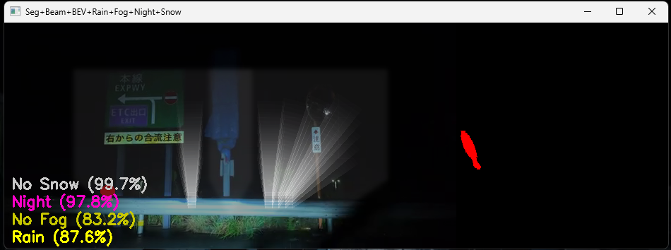
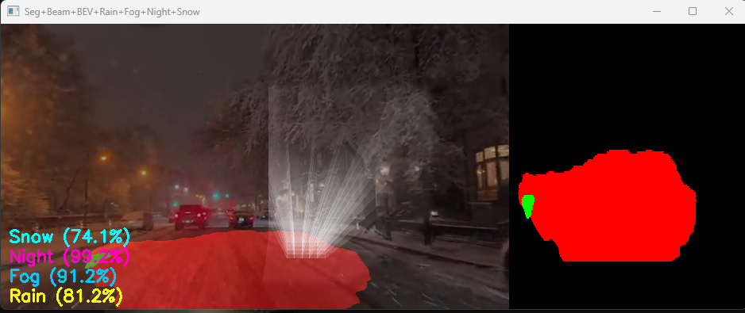
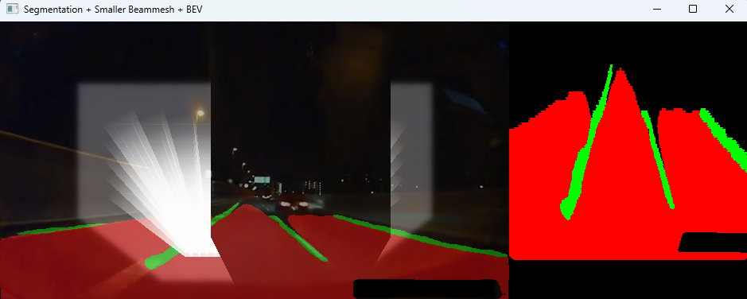
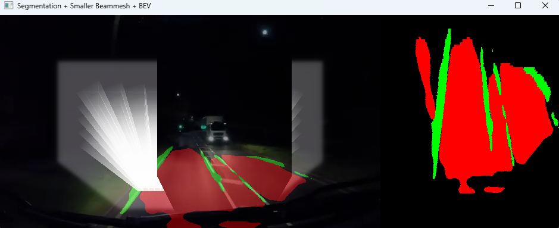

---

# Intelligent Matrix Headlights Simulator

Here is a full operational simulator of an intelligent matrix headlight system for automotive applications. It processes live video (or YouTube streams) to render real-time adaptive beam patterns, based on both environmental conditions and detected objects on the road.
## System Overview

* **Input:** Real or streamed driving video.
* **Core Components:**

  * **Object Detection:** YOLOv5x, custom-trained, recognizes cars, trucks, signs, etc.
  * **Semantic Segmentation:** U-Net with ResNet-34 backbone, segments road, lane lines, and background.
  * **Adverse Weather Detection:** Four separate ResNet-18 classifiers for rain, fog, snow, and night, each triggering weather-specific preprocessing and dynamic changes in lighting logic.
  * **Beam Simulation:** Grid-based, 3D effect beams rendered per-frame, with intensity, occlusion, and glow all modulated by both detected obstacles and weather.
  * **Bird's-Eye View (BEV):** Top-down visualization of lane/road and detected objects for debugging and presentation.

## Key Features

* **Dynamic Beam Modulation:**
  The beam pattern automatically adapts to detected cars and traffic signs, dimming or blocking parts of the light to mimic real adaptive headlights.
* **Weather-Responsive Processing:**
  The system switches between high and low beams depending on real-time predictions of rain, fog, snow, or night. It also applies specialized preprocessing (dehazing, highlight suppression, gamma correction) before running segmentation in tough conditions.
* **Real-Time Multi-Modal Analysis:**
  Each video frame is analyzed for object detection, weather state, semantic segmentation, and then combined into a single output. Overlay visualizations include segmentation, beam mesh, glow, BEV, and annotated probabilities.
* **Modular and Extensible:**
  Every component (detection, segmentation, weather, beam rendering) is decoupled, making it easy to upgrade models or swap in new techniques as research evolves.

## Processing Pipeline

1. **Weather Classification:**
   Each frame is first run through four parallel classifiers (rain, fog, snow, night/day). If a weather event exceeds a threshold, both the lighting simulation and preprocessing adapt accordingly.

2. **Preprocessing (if needed):**

   * Fog: Fast dark-channel dehazing.
   * Rain: Suppression of specular highlights.
   * Snow: Gamma correction + local contrast equalization.

3. **Semantic Segmentation:**
   The preprocessed (or original) frame is segmented by a U-Net, producing masks for road, lanes, and background.

4. **Object Detection:**
   YOLOv5x identifies vehicles and signs. Their positions and confidences are used to modulate the beams.

5. **Beam Mesh Rendering:**
   A 3D mesh is drawn to simulate real headlight beams, divided into cells. Cells containing vehicles are turned off (to avoid glare), those with signs are dimmed, and all others are rendered at appropriate opacity. Glow halos are applied using Gaussian blurring.

6. **Bird's-Eye View (BEV):**
   The segmented output and object detections are projected to a top-down view for visual diagnostics.

7. **Annotation and Display:**
   The current weather and day/night probabilities are overlaid. All effects are composited with the original video and BEV, and streamed to the display and (optionally) saved as video.

## Example Outputs

* **Intelligent dimming:** The system recognizes when other vehicles or signs are ahead and automatically dims only the relevant part of the beam, shown in the mesh and overlay.
* **Weather adaptation:** In heavy rain, fog, or snow, the beams switch to low mode, and the segmentation is enhanced for tough conditions.
* **Continuous BEV mapping:** A synchronized top-down map accompanies the video for clarity in evaluation.

---

</img>

</img>

</img>

</img>

</img>

</img>

Here’s a description you can use under your **Future Implementation** section in your README or thesis, referencing the provided diagram:

## Future Implementation

The diagram above illustrates a **proposed hardware-software architecture** for a fully integrated intelligent matrix headlight system. This future vision moves beyond pure software simulation and shows how the current perception pipeline could be deployed in a real automotive environment.

**Key Elements:**

* **Multi-camera input:** Multiple cameras capture the scene, enabling redundancy or different fields of view.
* **Modular Perception:** Each camera feeds three parallel modules:

  * **Weather Condition Detector** (predicts rain, fog, snow, or night/day).
  * **Sign/Car Recognizer** (detects vehicles and traffic signs).
  * **Road Segmenter** (extracts road/lane mask).
* **Automotive Integration:**
  All perception results are sent via a **CANBus Interface**, a standard in automotive electronics, to a central **Beam Pattern Manager**.
* **Real-Time Beam Adaptation:**
  The Beam Pattern Manager fuses all perception signals and computes the optimal beam pattern, considering detected obstacles, weather, and road shape.
* **Actuation Pipeline:**
  The calculated beam pattern is passed through a **Matrix Display Driver** to the **LED Driver IC**, which directly controls the **Matrix Display**—the actual hardware array of adaptive headlight LEDs.

**Workflow highlights:**

* Processing is distributed, allowing parallel execution for real-time performance.
* Weather, object, and road context are fused to make dynamic, safety-aware lighting decisions.
* Hardware integration points (CANBus, SPI) are shown explicitly, underlining readiness for embedded deployment.

This architecture demonstrates how the research prototype can evolve into a robust embedded system suitable for automotive production, combining advanced perception with direct hardware control.

---
