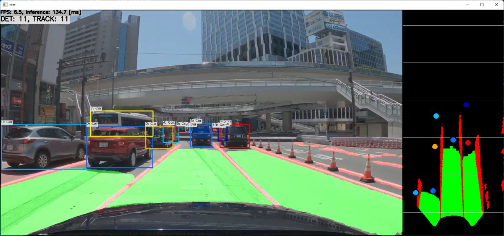

---

# Road and Vehicle Detection Using HybridNets (ONNX / TFLite)

## Table of Contents

1. [Introduction](#introduction)  
2. [Requirements](#requirements)  
3. [Preparing the Environment](#preparing-the-environment)  
4. [Downloading Code and Installation](#downloading-code-and-installation)  
5. [Downloading HybridNets Models](#downloading-hybridnets-models)  
6. [Building the Project (TFLite) in Linux/WSL](#building-the-project-tflite-in-linuxwsl)  
7. [Running the Detection](#running-the-detection)  
8. [Working with YouTube Videos](#working-with-youtube-videos)  
9. [Troubleshooting](#troubleshooting)  
10. [Additional Resources](#additional-resources)  

---

## 1. Introduction
The HybridNets implementation enables real-time simultaneous road and vehicle detection. The project uses models in ONNX format and TFLite format (depending on the repository and how you choose to run it).

In this guide, we will use:
- The [ibaiGorordo/ONNX-HybridNets-Multitask-Road-Detection](https://github.com/ibaiGorordo/ONNX-HybridNets-Multitask-Road-Detection) repository – if we want to run HybridNets in ONNX format.  
- The [iwatake2222/play_with_tflite](https://github.com/iwatake2222/play_with_tflite/tree/master/pj_tflite_perception_hybrid_nets) repository – if we want to build and run the project in TFLite format.  
- Models from [PINTO0309/PINTO_model_zoo](https://github.com/PINTO0309/PINTO_model_zoo/tree/main/276_HybridNets) – containing the compiled HybridNets models.

---

## 2. Requirements
- **Operating System**: Recommended Linux or WSL (Windows Subsystem for Linux) with Ubuntu (or another compatible distribution).  
- **Python 3.7+** (or newer), depending on the library requirements.  
- **OpenCV 4.x** (needed, among others, for video processing).  
- **Git** (for cloning repositories).  
- **CMake** and build tools (make, gcc, g++, or another compiler) – if running TFLite on Linux/WSL.

---

## 3. Preparing the Environment
1. **Using WSL is recommended** (Windows Subsystem for Linux), because on Windows you may encounter issues with some libraries required by the project.  
2. Install the necessary system dependencies, for example:
   ```bash
   sudo apt-get update
   sudo apt-get install -y build-essential cmake python3-dev python3-pip git
   ```
3. (Optional) If you are working on **Linux** (without Windows), you can skip WSL installation.

---

## 4. Downloading Code and Installation
### A) Cloning the ONNX repository (optional)
If you want to use **ONNX** HybridNets:
```bash
git clone https://github.com/ibaiGorordo/ONNX-HybridNets-Multitask-Road-Detection.git
cd ONNX-HybridNets-Multitask-Road-Detection
pip install -r requirements.txt
```
**NOTE**:  
- In some cases, you may need to use `python3 -m pip install -r requirements.txt`.  
- The `youtube_dl` library may be outdated – it is recommended to replace it with `yt_dlp`.

### B) Cloning the TFLite repository (optional)
If you want to use **TFLite** HybridNets (the [iwatake2222/play_with_tflite](https://github.com/iwatake2222/play_with_tflite) repository):
```bash
git clone https://github.com/iwatake2222/play_with_tflite.git
cd play_with_tflite
git submodule update --init
sh InferenceHelper/third_party/download_prebuilt_libraries.sh
sh ./download_resource.sh
```
Then go to the `pj_tflite_perception_hybrid_nets` directory, where the HybridNets TFLite project is located.

---

## 5. Downloading HybridNets Models
1. Go to the [PINTO0309/PINTO_model_zoo](https://github.com/PINTO0309/PINTO_model_zoo/tree/main/276_HybridNets) repository.  
2. Run the script to download the models (e.g., in your working directory):
   ```bash
   git clone https://github.com/PINTO0309/PINTO_model_zoo.git
   cd PINTO_model_zoo/276_HybridNets
   sh download.sh
   ```
3. Once the download is complete, in the `276_HybridNets` directory you will find, among others, the files:
   - `hybridnets_384x640/model_float32.tflite`
   - `hybridnets_384x640/hybridnets_384x640.onnx`

4. Copy the appropriate models to your project:  
   - **TFLite**: copy `hybridnets_384x640.tflite` to `build/resource/model/hybridnets_384x640.tflite` (or another directory, according to your TFLite project instructions).  
   - **ONNX**: copy `hybridnets_384x640.onnx` to `build/resource/model/hybridnets_384x640.onnx` (or another folder, according to your configuration).

---

## 6. Building the Project (TFLite) in Linux/WSL
If you have chosen the **TFLite** version, follow the instructions in [pj_tflite_perception_hybrid_nets](https://github.com/iwatake2222/play_with_tflite/tree/master/pj_tflite_perception_hybrid_nets).  
Below is a short version:

1. Go to the directory with the selected project, for example:
   ```bash
   cd pj_tflite_perception_hybrid_nets
   ```
2. Create a `build` directory and enter it:
   ```bash
   mkdir -p build && cd build
   ```
3. Run CMake:
   ```bash
   cmake ..
   ```
4. Use `make` to build the project:
   ```bash
   make
   ```
5. After successfully completing the compilation, run the executable:
   ```bash
   ./main
   ```
---

## 7. Running the Detection
### ONNX
1. Run the main script (depending on the file you choose, e.g., `python video_bird_eye_view_road_detection.py` or another) in the [ibaiGorordo/ONNX-HybridNets-Multitask-Road-Detection](https://github.com/ibaiGorordo/ONNX-HybridNets-Multitask-Road-Detection) repository.
2. Make sure the `.onnx` file is located in the path expected by the script (or that you provide the correct path in the code).

</img>

</img>


### TFLite
1. After building (as described in [Section 6](#building-the-project-tflite-in-linuxwsl)), run the `./main` binary.
2. If needed, modify the paths to models or video files in the TFLite project source code.

This way, you will build and run the TFLite project based on HybridNets. If you want to run the default specifications you run only ./main but If you want Video you should run it with './main /path/to/your/video.mp4'


### Default:

</img>

### with video:

</img>

---

## 8. Working with YouTube Videos
1. **Switching from `youtube_dl` to `yt_dlp`:**  
   If your project uses the `youtube_dl` module, which is currently unsupported, it is recommended to switch to `yt_dlp`:
   ```bash
   pip uninstall youtube_dl
   pip install yt_dlp
   ```
2. Update your scripts by changing imports:
   ```python
   # old version
   import youtube_dl

   # new version
   import yt_dlp as youtube_dl
   ```
3. If you encounter issues playing videos directly from YouTube, it is recommended to first download the video file to your disk and then run the script on the local file.

---

## 9. Troubleshooting
- **Running in a Windows environment**:  
  Many people encounter library issues when running on Windows (e.g., missing library versions). Therefore, **WSL** or native Linux is recommended.
- **`bird_eye` module**:  
  In the `video_bird_eye_view_road_detection.py` file, there may be code related to the “bird-eye view” perspective. If errors occur in this area, you can temporarily disable or remove the parts of the code related to the “bird_eye” functionality.
- **Missing model files**:  
  Make sure you have downloaded the models and copied them to the correct directory (`resource/model/...`) or any other directory indicated in the scripts.
- **Errors with `cmake` or `make`**:  
  Make sure you have the latest versions of CMake and the compiler (e.g., `gcc`). Also check if anything has changed in the TFLite project dependencies (`third_party`).

---

## 10. Additional Resources
- [HybridNets ONNX Repository (ibaiGorordo)](https://github.com/ibaiGorordo/ONNX-HybridNets-Multitask-Road-Detection)  
- [HybridNets TFLite Repository (iwatake2222)](https://github.com/iwatake2222/play_with_tflite/tree/master/pj_tflite_perception_hybrid_nets)  
- [PINTO0309 Repository with HybridNets models](https://github.com/PINTO0309/PINTO_model_zoo/tree/main/276_HybridNets)  
- [Official README in the iwatake2222 repository (additional instructions)](https://github.com/iwatake2222/play_with_tflite/blob/master/README.md)

---

### Acknowledgments
Many thanks to all the authors of the above repositories for providing the source code, models, and detailed instructions, making it possible to quickly run HybridNets.

If you have additional questions or problems, feel free to open [Issues](https://github.com/ibaiGorordo/ONNX-HybridNets-Multitask-Road-Detection/issues) in the relevant repositories or contact the authors directly.
