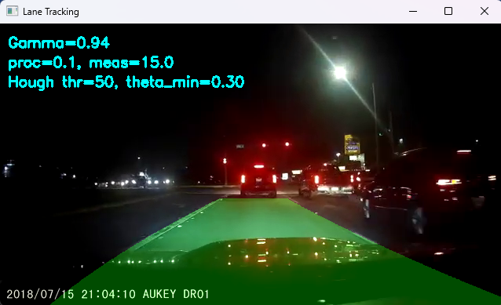
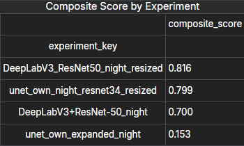

## Road & Lane Segmentation Benchmark

This repository implements and compares a range of semantic‑segmentation approaches on a custom dash‑cam dataset collected in Makassar City (374 images, 2560×1600px, four classes: Background, Road, Lane‑solid, Lane‑dashed).

### Tested Models

* **SegFormer**
  Lightweight transformer encoder + MLP decoder; achieved 97.8% pixel‑accuracy and 72.2% mIoU on training, 96.8% / 74.0% on validation.

* **DeepLabV3 + ResNet-50**
  Atrous convolutions, ASPP module; chosen for night scenarios due to superior lane IoU and real‑time viability.

* **U-Net (basic & expanded)**

  * **Basic** (scratch U-Net): \~88% road IoU, \~30% lane IoU, \~58% mean IoU.
  * **ResNet-34 encoder + Albumentations**: \~83% road, \~38% lane, \~60% mean IoU on adverse conditions.

* **YOLOP**
  End‑to‑end multitask (object detection + drivable‑area segmentation + lane marking) with real‑time efficiency (inference \~0.26s/frame).

* **OpenCV Pipeline**
  Classical CV (gamma correction, Canny, Hough, curve fitting, Kalman smoothing). Fast, lightweight, but less robust under poor or missing markings.

### Performance Metrics

|                              Model | Conditions             | Lane IoU | Road IoU | Mean IoU                     |
| ---------------------------------: | :--------------------- | :------: | :------: | :--------------------------- |
|                          SegFormer | Day & Night            |     ―    |     ―    | 0.7403                       |
|              DeepLabV3 (ResNet-50) | Day & Night            |   > 0.5  |   > 0.5  | > 0.5                        |
|                      U-Net (basic) | Day & Night            |   0.30   |   0.88   | 0.58                         |
| U-Net (ResNet-34 + Albumentations) | Night, adverse weather |   0.38   |   0.83   | 0.60                         |
|                              YOLOP | Real‑time automotive   |     ―    |     ―    | Real‑time efficient          |
|                             OpenCV | Various conditions     | Moderate | Moderate | Moderate, resource‑efficient |

</img>

</img>

</img>

</img>

</img>

### Final Choice

* **U-Net34 (ResNet-34 + Albumentations)**
  Offers the best trade‑off: 60% mean IoU on mixed conditions, \~9.5h training, lightweight deployment.

---
