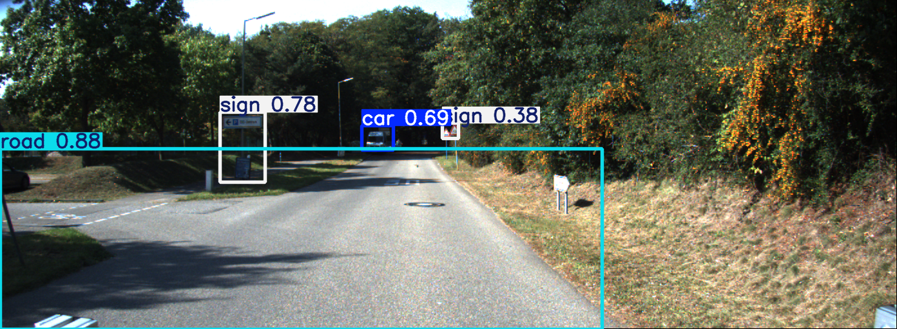

---

# YOLOv5 Object Detection from Car Recordings

This repository demonstrates how to:
1. Create a custom dataset from car recordings,
2. Label the dataset in YOLO format,
3. Train YOLOv5 models on this dataset, and
4. Evaluate the performance of different YOLOv5 models.

## 1. Dataset Creation

### 1.1 Data Sources

The images used in this project come from three publicly available datasets:

- **KITTI** (Raw Data): [KITTI Raw Data](https://www.cvlibs.net/datasets/kitti/raw_data.php)  
- **PVDN** (Provident Vehicle Detection at Night): [PVDN on Kaggle](https://www.kaggle.com/datasets/saralajew/provident-vehicle-detection-at-night-pvdn)  
- **GTSDB** (German Traffic Sign Detection Benchmark): [GTSDB Dataset](https://benchmark.ini.rub.de/gtsdb_dataset.html)

In total, we used circa 4000 images collected from the above datasets

### 1.2 Image Format Conversion

The GTSDB dataset originally contained images in **PPM** format. To ensure compatibility with most machine learning pipelines, we converted these images to **PNG** using a custom Python script.

```bash
# Example command for format conversion (pseudo-code):
from PIL import Image
import os

input_folder = r".venv\Day_night_detection\dataset\test\day"
output_folder = r".venv\Day_night_detection\dataset\test\day"

for filename in os.listdir(input_folder):
    if filename.endswith(".ppm"):
        input_path = os.path.join(input_folder, filename)
        output_path = os.path.join(output_folder, filename.replace(".ppm", ".png"))
        
        with Image.open(input_path) as img:
            img.save(output_path, "PNG")
        
        print(f"Converted {input_path} to {output_path}")
```

### 1.3 Image Resizing

For consistent input dimensions, **all images** were resized to **1392 x 512**.  


### 1.4 Train/Test Split

The dataset was then split into:
- A **training set** (e.g., 75% of images),
- A **test set** (e.g., 25% of images).


---

## 2. Label Creation (YOLO Format)

Labels for both training and test sets were created using:

- [LabelImg](https://pypi.org/project/labelImg/)
- [labelme](https://github.com/wkentaro/labelme)

These tools allow bounding box annotation for each object of interest. The labels were exported in:
- **YOLO** text format (`.txt`) for each image, and
- **JSON** format (`.json`)—both a single aggregated file and individual JSON files for each image.

---

## 3. Label Organization & Naming

A custom Python script was used to:
- Match each image with its corresponding label file,
- Unify naming conventions,
- Ensure each label belongs to the correct class.

This helped maintain a clean dataset structure where each image (e.g., `00000001.png`) has a matching label file (e.g., `00000001.txt`).

In Each Labeled file we have 4 classes Car, People, Road and Sign 

---

## 4. YOLOv5 Training

We conducted experiments using different YOLOv5 model sizes to compare their performance:
- **yolov5s** (small),
- **yolov5m** (medium),
- **yolov5x** (extra large).

### 4.1 Training Setup

1. Clone the [Ultralytics YOLOv5 repository](https://github.com/ultralytics/yolov5).
2. Place your training images and labels in the `train` directory, and your testing images and labels in the `test` directory (or follow any standard YOLOv5 folder structure).
3. Edit the `data.yaml` file to point to your dataset paths and specify your classes.
4. Run training with a command such as:

```bash
!python C:\Users\janmi\PycharmProjects\Magisterka\yolov5\train.py --img 640 --batch 16 --epochs 100 --data C:\Users\janmi\PycharmProjects\Magisterka\yolov5\car_dataset.yaml --weights C:\Users\janmi\PycharmProjects\Magisterka\yolov5\yolov5x.pt
```


### 4.2 Results

After training, YOLOv5 generates a `results.png` file and a `runs/train/expX` folder (where `expX` is your experiment name). You can also visualize predictions with:

```bash
!python C:\Users\janmi\PycharmProjects\Magisterka\yolov5\detect.py --weights C:\Users\janmi\PycharmProjects\Magisterka\yolov5\runs\train\exp4\weights\best.pt --img 640 --conf 0.25 --source C:\Users\janmi\PycharmProjects\Magisterka\yolov5\images\test
```

Aleo the experiments are saved into your comet-ml account.

### 4.3 Example Results

Below are some example images showing model performance, accuracy, and loss curves during training, as well as detection outputs:

</img>

</img>

---

## Contributing

If you wish to contribute or improve this project, feel free to open a pull request or issue.

---

## License

This project follows the license terms of the respective datasets (KITTI, PVDN, GTSDB) and the [Ultralytics YOLOv5 License](https://github.com/ultralytics/yolov5/blob/master/LICENSE).

---

## Acknowledgments

- [KITTI Dataset](https://www.cvlibs.net/datasets/kitti/)
- [PVDN on Kaggle](https://www.kaggle.com/datasets/saralajew/provident-vehicle-detection-at-night-pvdn)
- [GTSDB](https://benchmark.ini.rub.de/gtsdb_dataset.html)
- [LabelImg](https://pypi.org/project/labelImg/)
- [labelme](https://github.com/wkentaro/labelme)
- [Ultralytics YOLOv5](https://github.com/ultralytics/yolov5)

---