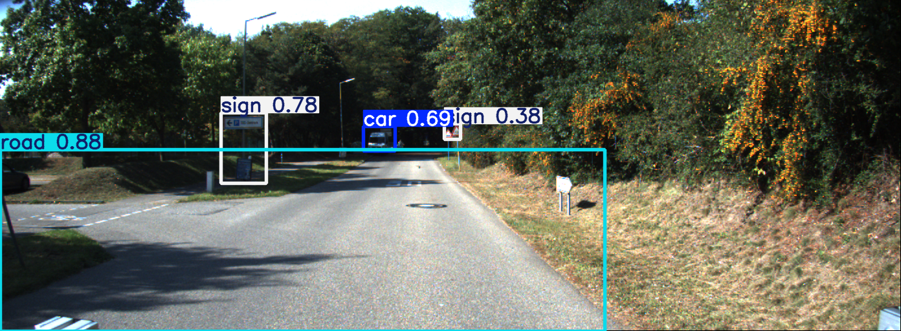

---

# Road & Car Object Detection with YOLOv5 and YOLOv8

---

## Table of Contents

1. [YOLOv5 Object Detection from Car Recordings](#yolov5-object-detection-from-car-recordings)
2. [YOLOv8 Road Object Detection](#yolov8-road-object-detection)
3. [Comparison of YOLOv5 vs. YOLOv8](#comparison-of-yolov5-vs-yolov8)

---

## YOLOv5 Object Detection from Car Recordings

This section shows how to:

1. Create a custom dataset from car recordings
2. Label the dataset in YOLO format
3. Train YOLOv5 models
4. Evaluate and compare their performance

### 1. Dataset Creation

#### 1.1 Data Sources

* **KITTI** (Raw Data): [KITTI Raw Data](https://www.cvlibs.net/datasets/kitti/raw_data.php)
* **PVDN** (Provident Vehicle Detection at Night): [PVDN on Kaggle](https://www.kaggle.com/datasets/saralajew/provident-vehicle-detection-at-night-pvdn)
* **GTSDB** (German Traffic Sign Detection Benchmark): [GTSDB Dataset](https://benchmark.ini.rub.de/gtsdb_dataset.html)

Total: \~4000 images.

#### 1.2 Image Format Conversion

Convert `.ppm` → `.png` via Pillow:

```python
from PIL import Image
import os

in_folder = "dataset/test/day"
out_folder = "dataset/test/day"

for fn in os.listdir(in_folder):
    if fn.endswith(".ppm"):
        img = Image.open(os.path.join(in_folder, fn))
        img.save(os.path.join(out_folder, fn.replace(".ppm", ".png")))
```

#### 1.3 Resizing & Split

* Resize to **1392 × 512**
* Split: **75% train / 25% test**

---

### 2. Label Creation (YOLO Format)

Use [LabelImg](https://pypi.org/project/labelImg/) or [labelme](https://github.com/wkentaro/labelme) to draw bounding boxes and export:

* YOLO text files (`.txt`)
* JSON (single and per-image)

Classes: **Car**, **People**, **Road**, **Sign**

---

### 3. Organizing & Naming

A Python script matches each image (e.g., `00000001.png`) to its label `00000001.txt`, unifies naming, and ensures correctness.

---

### 4. YOLOv5 Training

Experiments: **yolov5s**, **yolov5m**, **yolov5x**

1. Clone [Ultralytics YOLOv5](https://github.com/ultralytics/yolov5)

2. Prepare `data.yaml` (paths & classes)

3. Train:

   ```bash
   python train.py \
     --img 640 \
     --batch 16 \
     --epochs 100 \
     --data car_dataset.yaml \
     --weights yolov5x.pt
   ```

4. Inference:

   ```bash
   python detect.py \
     --weights runs/train/expX/weights/best.pt \
     --img 640 \
     --conf 0.25 \
     --source images/test
   ```

Outputs saved in `runs/train/exp*`.

<table>
  <tr>
    <td align="center"><b>YOLOv5 Sample Detection</b><br>
      
    </td>
    <td align="center"><b>YOLOv5 Inference Animation</b><br>
      
    </td>
  </tr>
</table>

---

## YOLOv8 Road Object Detection

Fine-tune YOLOv8 on BDD100K to detect road objects/signs in Polish roads.

### Introduction

* **Model**: YOLOv8 (Ultralytics)
* **Classes**:

  ```
  car, different-traffic-sign, green-traffic-light,
  motorcycle, pedestrian, pedestrian-crossing,
  prohibition-sign, red-traffic-light,
  speed-limit-sign, truck, warning-sign
  ```

### Project Structure

```
.
├── notebooks/
│   ├── data/bdd100k.names
│   └── data_processing.ipynb
├── road_detection_model/
│   ├── data.yaml
│   ├── data_finetune.yaml
│   ├── train.py
│   ├── validate.py
│   ├── live.py
│   ├── Models/
│   │   ├── yolov8n.pt
│   │   └── fine_tuned_yolov8s.pt
│   └── runs/
├── test_images/
│   └── test_film.mp4
└── README.md
```

### Dataset (BDD100K)

1. Download images & labels
2. Extract train/val/test zips
3. Convert JSON annotations → YOLO `.txt` in `notebooks/data_processing.ipynb`

### Training

Install dependencies:

```bash
pip install ultralytics comet_ml
```

Train:

```bash
cd road_detection_model
python train.py \
  --config data_finetune.yaml \
  --epochs 50 \
  --batch-size 16
```

### Inference

Static images or video (`test_film.mp4`):

```bash
python live.py \
  --weights Models/fine_tuned_yolov8s.pt \
  --source test_images/test_film.mp4
```

Results & logs in `runs/`.

<table>
  <tr>
    <td align="center"><b>YOLOv8 Visualization GIF</b><br>
      
    </td>
    <td align="center"><b>YOLOv8 Road Detection Output</b><br>
      
    </td>
  </tr>
</table>

---

## Comparison of YOLOv5 vs. YOLOv8

Based on training curves (first 100 epochs) and a composite score summary:

| Experiment | Composite Score |
| ---------- | --------------- |
| **YOLOv5** | 0.60            |
| **YOLOv8** | 0.40            |

### Key Observations

* **mAP\@0.5–0.95**

  * YOLOv8 stabilizes around **0.26–0.28**
  * YOLOv5 around **0.20–0.22**
* **mAP\@0.5**

  * YOLOv8: \~**0.40–0.45**
  * YOLOv5: \~**0.50–0.60**
* **Precision**

  * YOLOv5 achieves higher and more stable precision (\~0.65–0.75)
  * YOLOv8 precision fluctuates more (\~0.50–0.80)
* **Recall**

  * YOLOv5 reaches \~**0.50–0.60**
  * YOLOv8 around **0.38–0.43**

<table>
  <tr>
    <td align="center"><b>YOLOv5 vs YOLOv8 : Loss vs Epoch</b><br>
      
    </td>
    <td align="center"><b>YOLOv5 vs YOLOv8: Loss vs Epoch</b><br>
      
    </td>
  </tr>
  <tr>
    <td align="center"><b>YOLOv5 vs YOLOv8: mAP@0.5 vs Epoch</b><br>
      
    </td>
    <td align="center"><b>YOLOv5 vs YOLOv8: mAP@0.5 vs Epoch</b><br>
      
    </td>
  </tr>
  <tr>
    <td align="center" colspan="2"><b>Composite Table Summary</b><br>
      
    </td>
  </tr>
</table>

### Trade-Offs

* **YOLOv5** shows **higher precision & recall**, leading to a **better composite score**.
* **YOLOv8** achieves **higher overall mAP50–95**, indicating better average accuracy across stricter IoU thresholds.
* Choice depends on whether you prioritize **precision/recall** (YOLOv5) or **higher mAP at varied IoUs** (YOLOv8).

---

## Acknowledgments & Licenses

* **Datasets**: KITTI, PVDN, GTSDB, BDD100K
* **Models**: Ultralytics YOLOv5 & YOLOv8
* **Annotation Tools**: LabelImg, labelme

---
