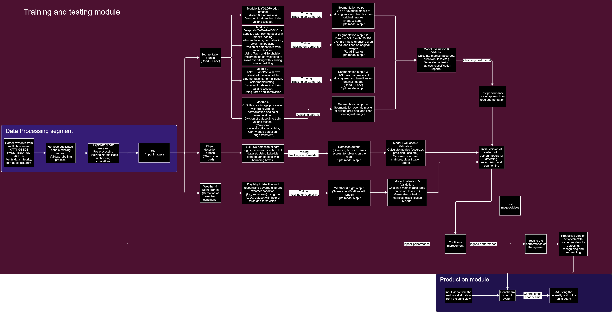
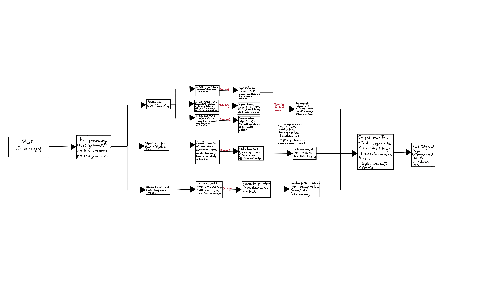
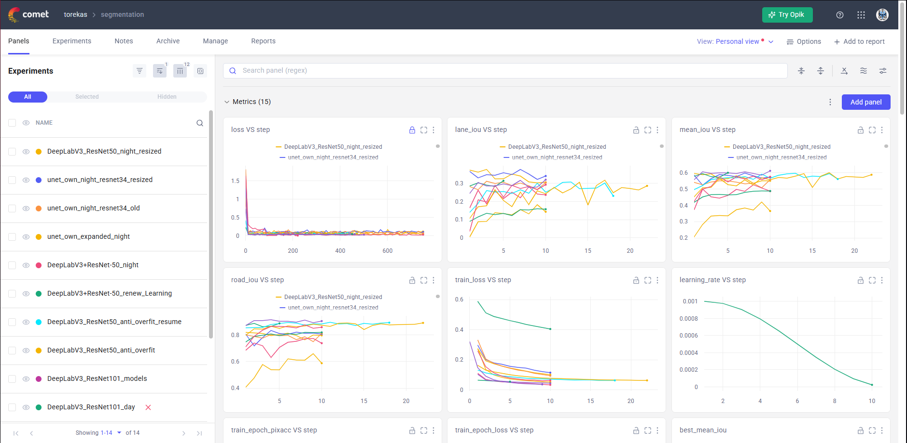

---

# Master Thesis

This thesis focuses on intelligent Matrix headlights in automobiles. The goal is to identify the best possible solution for detecting the most crucial elements on the road for drivers, leveraging various models.

Currently, this repository contains several approaches, including:

* **Distinguishing between day and night.**
* **Recognizing different weather conditions** (snow, rain, fog) based on diverse image sets.
* **Detecting important road elements** such as traffic signs, pedestrians, vehicles, and the roadway itself. Three solutions are used here:

  * **A solution using the YOLOv5 model.**
  * **A solution using the YOLOv8 model.**
  * **A solution leveraging an ONNX-based model.**
* **Segmentation of the road with different approaches:**

  * **SegFormer**
  * **YOLOP**
  * **U-Net + ResNet-34**
  * **DeepLabV3+ResNet-50/100**
* **A full working simulator** that combines all components with a mechanism for steering the matrix headlights.
* **Future work**: possible prototype design and deployment concepts.

Each approach is accompanied by a dedicated `.ipynb` notebook or `.py` file in each approach subfolder, which explains the steps taken in each case.

---

## Workflow Pipelines & Experiment Tracking

<table>
  <tr>
    <td align="center"><b>Workflow Pipeline (v2)</b> 
      
    </td>
    <td align="center"><b>Workflow Pipeline (v1)</b> 
      
    </td>
  </tr>
  <tr>
    <td align="center" colspan="2"><b>Comet ML Experiment Tracking</b> 
      
    </td>
  </tr>
</table>

---

# Computers' Specs

## Laptop

### CPU and Overall Memory Status

| **Parameter**                  | **Value**                           |
| ------------------------------ | ----------------------------------- |
| MaxClockSpeed (MHz)            | 2592                                |
| Processor Name                 | Intel® Core™ i7-9750H CPU @ 2.60GHz |
| Number of Cores                | 6                                   |
| Number of Logical Processors   | 12                                  |
| **System Model:**              | ROG Strix G531GW\_G531GW            |
| **OS Name:**                   | Microsoft Windows 11 Pro            |
| **OS Version:**                | 10.0.26100 N/A Build 26100          |
| Total Physical Memory (MB)     | 16,234                              |
| Available Physical Memory (MB) | 4,241                               |
| Virtual Memory: Max Size (MB)  | 32,469                              |
| Virtual Memory: Available (MB) | 14,070                              |
| Virtual Memory: In Use (MB)    | 18,399                              |
| VRam (MB)                      | 8,006                               |

### Installed GPU Adapters

| AdapterRAM (GB) | DriverVersion  | Name                    | VideoModeDescription      |
| --------------- | -------------- | ----------------------- | ------------------------- |
| 1.00            | 26.20.100.6911 | Intel® UHD Graphics 630 | 1920 × 1080, 32-bit color |
| 4.00            | 32.0.15.7640   | NVIDIA GeForce RTX 2070 | 1920 × 1080, 32-bit color |

---

## PC

### CPU Specifications and Overall Memory Status

| **Parameter**                  | **Value**                  |
| ------------------------------ | -------------------------- |
| MaxClockSpeed (MHz)            | 2500                       |
| Processor Name                 | Intel® Core™ i5-14400F     |
| Number of Cores                | 10                         |
| Number of Logical Processors   | 16                         |
| **System Manufacturer:**       | LENOVO                     |
| **System Model:**              | 90UU00L7PL                 |
| **OS Name:**                   | Microsoft Windows 11 Pro   |
| **OS Version:**                | 10.0.26100 N/A Build 26100 |
| Total Physical Memory (MB)     | 32,490                     |
| Available Physical Memory (MB) | 19,139                     |
| Virtual Memory: Max Size (MB)  | 50,922                     |
| Virtual Memory: Available (MB) | 29,176                     |
| Virtual Memory: In Use (MB)    | 21,746                     |
| VRam (MB)                      | 7,949                      |

### Installed GPU Adapter

| AdapterRAM (GB) | DriverVersion | Name                       | VideoModeDescription      |
| --------------- | ------------- | -------------------------- | ------------------------- |
| 4.00            | 32.0.15.6103  | NVIDIA GeForce RTX 4060 Ti | 1920 × 1080, 32-bit color |

---

# Simulator in action
<table align = "center">
  <tr>
    <td align="center"><b>Simulator in action</b> 
      
    </td>
  </tr>
</table>