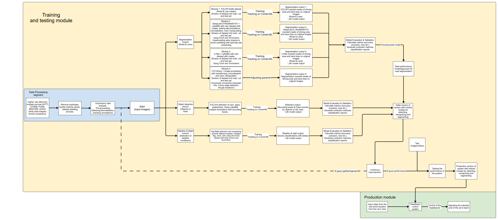

# Master Thesis

This thesis focuses on intelligent Matrix headlights in automobiles. The goal is to identify the best possible solution for detecting the most crucial elements on the road for drivers, leveraging various models.

Currently, this repository contains several approaches, including:

- **Distinguishing between day and night.**  
- **Recognizing different weather conditions (snow, rain, fog, and night) based on diverse image sets.**  
- **Detecting important road elements such as traffic signs, pedestrians, vehicles, and the roadway itself. Three solutions are used here:**  
  - **A solution using the YOLOv5 model.**  
  - **A solution using the YOLOv8 model.**  
  - **A solution leveraging an ONNX-based model.**

Each approach is accompanied by a dedicated *.ipynb notebook, which explains the steps taken in each case.

## Workflow Pipeline (v2)
</img>

## Workflow Pipeline (v1)
</img>